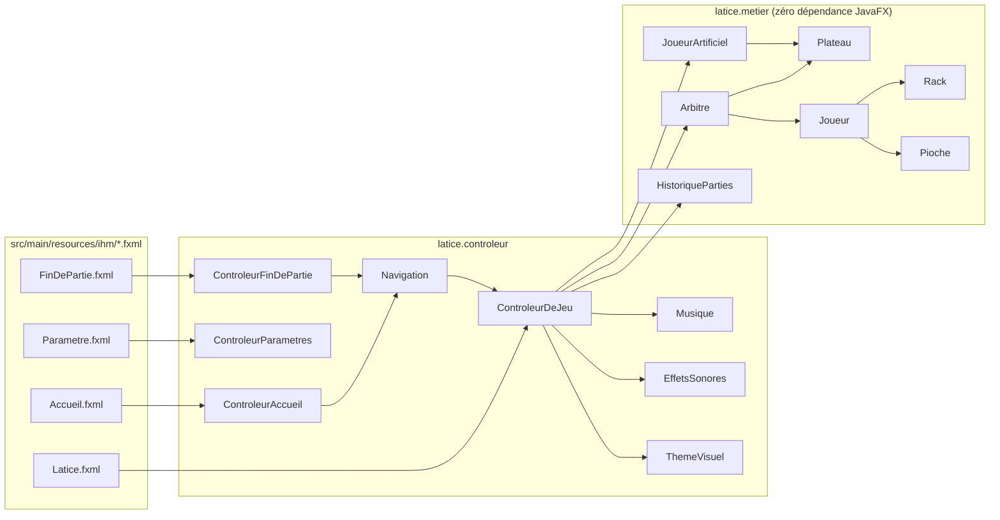
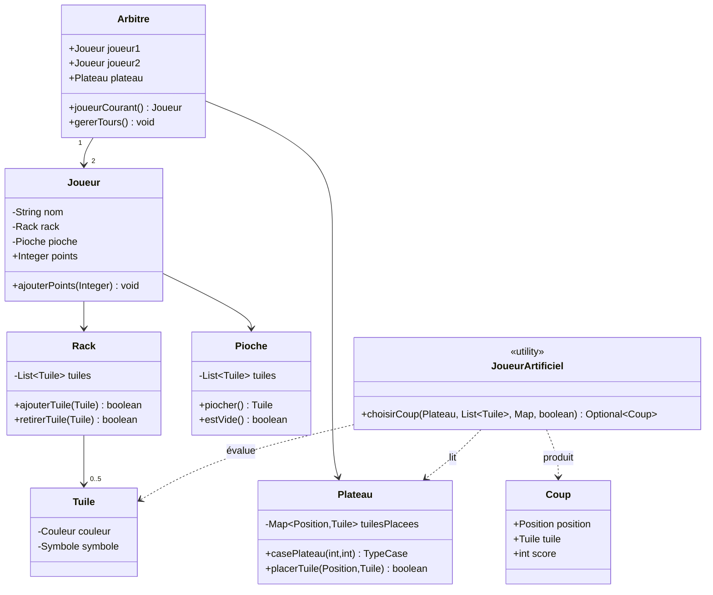
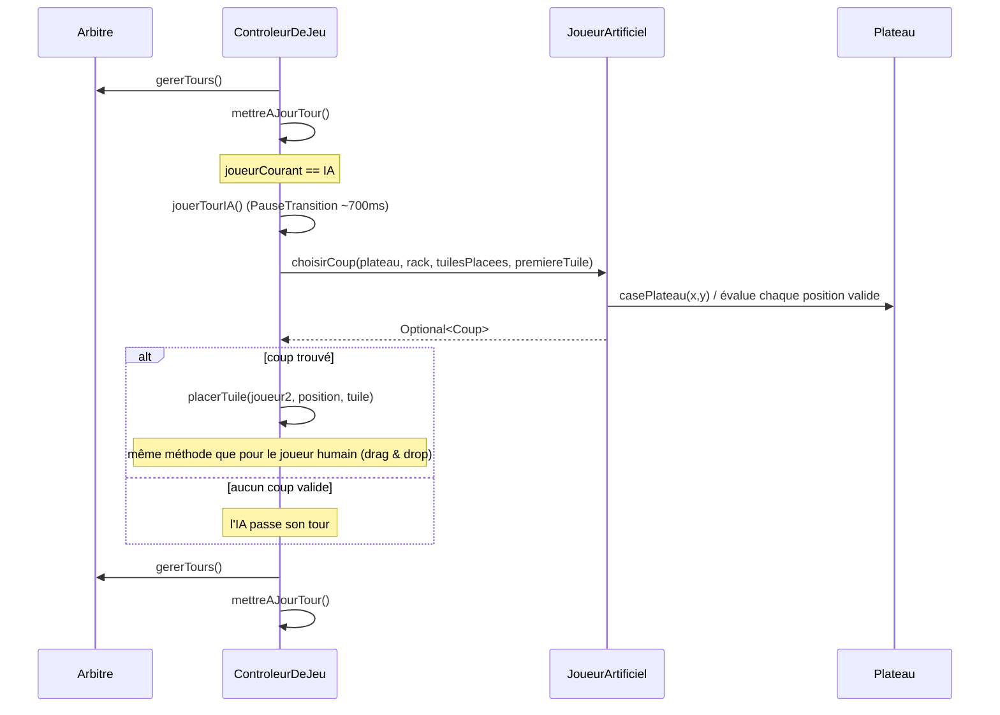

# Architecture

## Vue d'ensemble

Le code est séparé en deux packages qui ne dépendent jamais l'un de l'autre dans le mauvais sens :
`latice.metier` ne connaît rien de JavaFX (donc testable sans lancer d'interface graphique), et
`latice.controleur` orchestre l'UI en s'appuyant sur `latice.metier`.

## Diagramme de classes (cœur du moteur de jeu)

## Séquence : tour de l'IA

Illustre comment le joueur humain (drag & drop) et l'IA convergent vers la même méthode
`placerTuile(...)`, garantissant qu'aucune des deux voies ne peut appliquer des règles différentes.

## Pourquoi ces choix

- **`latice.metier` sans JavaFX** : `JoueurArtificiel` et `HistoriqueParties` sont testés par de simples tests JUnit, sans lancer de `Stage` ni de thread FX.
- **`Navigation` comme point d'entrée unique** : ouvrir le menu principal ou démarrer une partie passe toujours par la même classe, que ce soit au lancement de l'app, depuis "Nouvelle partie", ou depuis "Rejouer"/"Menu principal" en fin de partie — élimine la duplication de code de câblage FXML.
- **`placerTuile(...)` partagée** : le joueur humain (glisser-déposer) et l'IA appliquent la tuile via la même méthode, donc les mêmes règles de score/rack/repioche, sans jamais pouvoir diverger.
